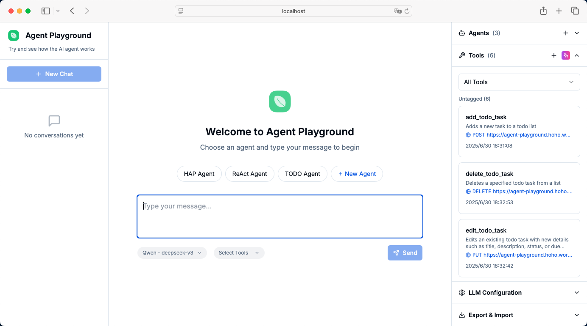
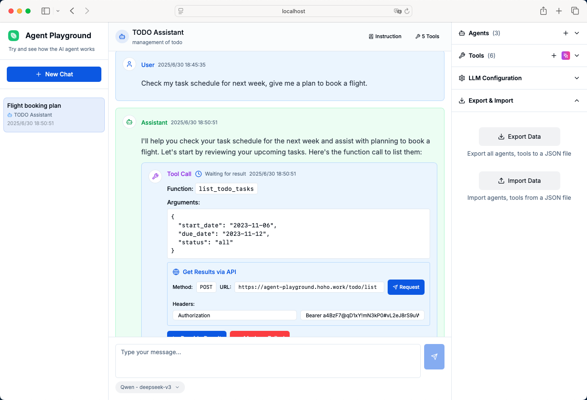

# Agent Playground 🤖

[](https://github.com/coldstone/agent-playground)
[](https://opensource.org/licenses/MIT)
[](https://www.npmjs.com/package/agent-playground)

A comprehensive development and debugging platform for AI Agents and Tools. Agent Playground helps developers create, test, and debug AI agents powered by various Large Language Models (LLMs) with custom tools and API integrations.





## ✨ Key Features

### 🤖 Multi-Agent Development
- **Agent Management**: Create and configure multiple AI agents with custom instructions
- **Agent Templates**: Pre-built agent templates for common use cases
- **AI-Powered Generation**: Generate agent instructions using AI assistance
- **Multi-Language Support**: Generate instructions in user's preferred language

### 🛠️ Advanced Tool System
- **Custom Tool Creation**: Build tools with JSON schema definitions
- **AI Tool Generator**: Generate tools automatically from natural language descriptions
- **HTTP Request Integration**: Configure tools to call external APIs
- **Manual Testing**: Test tools manually before agent integration
- **Tool Templates**: Quick-start templates for common tool patterns

### 🔌 Multi-LLM Provider Support
- **OpenAI**: GPT-4.1, GPT-4o, GPT-o1 and other OpenAI models
- **Deepseek**: Deepseek-chat and reasoning models
- **Qwen**: Alibaba's Qwen model family
- **Doubao**: ByteDance's AI models
- **Qianfan**: Baidu's AI platform
- **XunfeiXinhuo**: iFlytek's AI models
- **Ollama**: Local model deployment
- **Custom Providers**: Any OpenAI-compatible API endpoint

### 💬 Interactive Chat Interface
- **Real-time Streaming**: Live response streaming from LLMs
- **Tool Call Execution**: Watch agents use tools in real-time
- **Token Usage Tracking**: Monitor API costs and usage statistics
- **Model Information**: Display provider and model info for each response
- **Message Management**: Edit, retry, and delete messages
- **Session Management**: Multiple chat sessions with auto-save

### 🔧 Developer-Friendly Features
- **Local Storage**: All data stored locally in browser (IndexedDB)
- **Import/Export**: Backup and share agent/tool configurations
- **Hot Reload**: Instant updates during development
- **Error Handling**: Comprehensive error messages and debugging info
- **Responsive Design**: Works on desktop and mobile devices

### 🐳 Docker Support
- **Easy Deployment**: Docker Compose for instant setup
- **Development & Production**: Separate configurations for different environments
- **Health Monitoring**: Built-in health checks

## 🚀 Quick Start

### Option 1: Docker (Recommended)

```bash
# Clone the repository
git clone https://github.com/coldstone/agent-playground.git
cd agent-playground

# Start with Docker Compose
docker-compose up -d
```

Open `http://localhost:3001` in your browser. That's it! 🎉

### Docker Commands

```bash
# Development mode (with hot reload)
docker-compose -f docker-compose.dev.yml up

# Production mode
docker-compose build
docker-compose up

# Test Docker configuration
./scripts/test-docker.sh

# Stop services
docker-compose down
```

### Option 2: Run with npx (Node.js Required)

```bash
npx agent-playground
```

This command will automatically download and start Agent Playground on your local machine at `http://localhost:3001`.

### Option 3: Global Installation

```bash
npm install -g agent-playground
agent-playground
```


### Option 4: Local Development

```bash
git clone https://github.com/coldstone/agent-playground.git
cd agent-playground
npm install
npm run dev
```

## 📦 Installation Requirements

### For npm/npx installation:
- **Node.js**: Version 18.0.0 or higher
- **npm**: Version 8.0.0 or higher (comes with Node.js)
- **Modern Browser**: Chrome, Firefox, Safari, or Edge

### For Docker installation:
- **Docker**: Version 20.0.0 or higher
- **Docker Compose**: Version 2.0.0 or higher (optional, for easier management)
- **Modern Browser**: Chrome, Firefox, Safari, or Edge

## 🔧 Development Setup

### 1. Clone the Repository
```bash
git clone https://github.com/coldstone/agent-playground.git
cd agent-playground
```

### 2. Install Dependencies
```bash
npm install
```

### 3. Start Development Server
```bash
npm run dev
```

The application will start at `http://localhost:3001`.

### 4. Build for Production
```bash
npm run build
```

### 5. Start Production Server
```bash
npm start
```

## 📖 Usage Guide

### 1. Configure LLM Provider
1. Open the **LLM Configuration** panel on the right
2. Select your preferred provider (OpenAI, Deepseek, etc.)
3. Enter your API endpoint and API key
4. Choose a model from the dropdown
5. Test the connection

### 2. Create Your First Agent
1. Click the **Agents** button in the top toolbar
2. Click **New Agent** to create an agent
3. Fill in the agent name and description
4. Use **AI Generate** to create instructions automatically
5. Assign tools to your agent (optional)
6. Save the agent

### 3. Build Custom Tools
1. Click the **Tools** button in the top toolbar
2. Use **AI Generate** to create tools from descriptions
3. Or click **Custom** to manually define tool schemas
4. Configure HTTP requests for API integration
5. Test tools manually before assigning to agents

### 4. Start Debugging
1. Select an agent from the dropdown
2. Start a conversation to test agent behavior
3. Watch tool calls execute in real-time
4. Monitor token usage and API costs
5. Iterate and improve your agent configuration

## 🏗️ Building and Deployment

### Development Build
```bash
npm run dev
```

### Production Build
```bash
npm run build
```


### Linting
```bash
npm run lint
```

### Type Checking
```bash
npx tsc --noEmit
```


## 📁 Project Structure

```
agent-playground/
├── src/
│   ├── app/                 # Next.js app directory
│   ├── components/          # React components
│   │   ├── agents/          # Agent management components
│   │   ├── chat/            # Chat interface components
│   │   ├── config/          # Configuration components
│   │   ├── modals/          # Modal dialog components
│   │   ├── tools/           # Tool management components
│   │   ├── ui/              # Reusable UI components
│   ├── lib/                 # Utility libraries and services
│   │   ├── clients/         # API client implementations
│   │   ├── generators/      # AI-powered generators
│   │   ├── storage/         # Data persistence layer
│   └── types/               # TypeScript type definitions
├── bin/                     # Executable scripts
├── scripts/                 # Build and deployment scripts
│   └── test-docker.sh      # Docker test script
├── Dockerfile               # Docker image configuration
├── docker-compose.yml       # Docker Compose production configuration
├── docker-compose.dev.yml  # Docker Compose development configuration
├── .dockerignore           # Docker ignore file
├── docker-healthcheck.js   # Docker health check script
```

## 📝 License

This project is licensed under the MIT License - see the [LICENSE](LICENSE) file for details.

---

**Happy Agent Building!** 🚀
